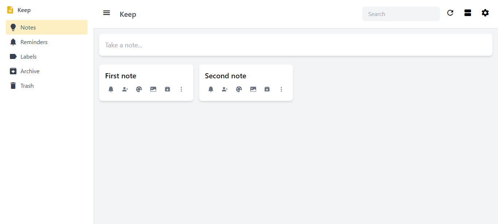

A Google Keep clone using ReactJS, TypeScript and Laravel

## Screens

## Todos
 - Make copy of the note ✅
 - Save copied note in database
 - Add Checkbox notes in Add modal ✅
 - Make common component for add and manage checkbox notes for Add and Edit component
 - While switching from checkbox to text on add mode, warn user if they want to keep/delete the completed checkboxes
 - Reset the modal when modal is closed ✅
 - Reorder notes in main section
 - Reorder checkboxes inside note
 - Reminder of notes
 - Pin and Unpin notes
 - Select notes on bulk and perform actions (e.g. Delete, Reminder, Archive)
 - Automatic trash of notes  after 7 days of deleting
 - Add labels
 - Search notes by labels
 - List and grid view of notes
 - Lazy load components for performance
 - Note version history
 - Authentication and login
 - Add collaborator
    - Live collaboration and editing
 - Add background color to notes
 - Website settings (e.g. Reminder times, Disable/Enable sharing)
 - Fix: on add mode of checkbox if enter is pressed new input box is not inserted ✅
 - Fix: on Add mode when switch to checkbox from empty text and trying type throws error ✅